<div align="center">

# 🏭 Officina Agenti

**A workshop where AI agents ship your side projects — and then teach you what you built.**

Agents pick ideas, write the code, open pull requests, publish to your portfolio,
and finish by explaining what you'd need to defend the work in an interview.
No servers, no database, no hosting bill.

[](https://docs.github.com/actions)
[](https://code.claude.com/docs/en/github-actions)
[](docs/)
[](#why-it-costs-nothing-to-run)
[](docs/app.js)
[](LICENSE)

</div>

---

## The idea

GitHub is already the backend everyone tries to build.

| You need | GitHub already gives you |
| --- | --- |
| A prompt queue | Issues |
| Progress tracking | Workflow runs, with logs and timings |
| Reviewable output | Pull requests |
| A database | A JSON file in the repo |
| Quality control | Branch protection |
| An API for your phone | REST, CORS-enabled, free |

So this repo adds the only things GitHub doesn't: five agents with a job each,
a control panel that fits in your pocket, and the guardrails that keep an
autonomous system from turning into forty junk PRs and a surprise bill.

**No agent can merge.** They produce branches and pull requests; a human moves
code to `main`. That isn't only caution — it's the reason you can still talk
about these projects in an interview.

---

## How it works

```mermaid
flowchart LR
    PWA["📱 PWA<br/><i>your phone</i>"] -->|opens issue| CTL["🏭 ai-factory<br/><i>issues + state</i>"]
    CTL -->|label / cron| ACT["⚙️ GitHub Actions<br/><i>ephemeral runner</i>"]
    ACT -->|branch + PR| PRJ["📦 project repo"]
    ACT -.->|writes state| CTL
    CTL -.->|reads state| PWA

    PRJ ==>|when finished| PUB["✍️ publisher"]
    PUB -->|PR on portfolio| REV{{"👤 you merge"}}
    REV -->|only then| DEP["🚀 deploy"]

    style ACT stroke:#1B8079,stroke-width:2px
    style PUB stroke:#1B8079,stroke-width:2px
    style REV stroke:#B0761A,stroke-width:2px
```



An issue is the prompt. A run is the progress bar. A pull request is the result.
The loop stops and waits for a human exactly twice: approving an idea, and
merging a PR.

---

## The five agents

| Agent | Wakes on | Model | What it produces |
| --- | --- | --- | --- |
| 🔭 **Scout** | Monday cron | Haiku | Three project ideas as issues, each tied to a skill worth showing |
| 📐 **Architect** | You approve an idea | Sonnet | A new repo, its `CLAUDE.md`, and 5–8 ordered build tasks |
| 🔨 **Builder** | An `agent:build` issue | Sonnet | Working code on a branch, tests passing, one PR |
| ✍️ **Publisher** | A project completes | Haiku | A PR on your portfolio: entry, blog post, screenshot |
| 🎓 **Mentor** | A project ships | Sonnet | `learnings/<slug>.md` — key decisions, interview questions, and the gaps |

The Mentor is what keeps the system honest. A portfolio full of projects you
can't explain is worth less than three projects you built yourself.

---

## Quickstart

```bash
gh repo create ai-factory --public --clone
# copy these files in, then:
git add . && git commit -m "Officina Agenti" && git push
```

Then four things: add your model credential as a repository secret, create the
four labels, install the [Claude GitHub App](https://github.com/apps/claude),
and turn on Pages from `main` → `/docs`.

**→ Full walkthrough in [SETUP.md](SETUP.md)**

Before spending a single token, dry-run it: set `paused: true`, trigger
`agent-scout`, and watch it stop at preflight.

---

## Configuration

Everything lives in one file. No code changes to switch model provider,
retune costs, or stop the world.

```yaml
provider: subscription          # subscription | api-key | foundry

agents:
  builder:  { model: sonnet, max_turns: 40, timeout_min: 35 }
  scout:    { model: haiku,  max_turns: 8,  timeout_min: 10 }

limits:
  max_runs_per_month_per_repo: 25   # hard stop, checked before any model runs
  max_open_prs_per_repo: 3          # no new work while review is backed up
  paused: false                     # kill switch, also a button in the app
```

---

## The control panel

A vanilla-JS PWA served from `docs/`. **Zero runtime dependencies** — no
framework, no build step, nothing loaded from a CDN. Install it from your phone
and it behaves like an app.

<table>
<tr>
<td width="25%"><b>Status</b><br/>Live runs, durations, project stages</td>
<td width="25%"><b>Ideas</b><br/>Approve or archive what Scout proposes</td>
<td width="25%"><b>New</b><br/>Write a prompt on the train</td>
<td width="25%"><b>Learned</b><br/>Mentor's notes, the night before an interview</td>
</tr>
</table>

It's gated by a password and keeps your GitHub token **encrypted at rest**
(AES-GCM, key derived with PBKDF2) instead of sitting in plain `localStorage`.
Sessions persist for 30 days; *Lock now* ends one immediately.

---

## Why it costs nothing to run

- **GitHub Actions** — free and unmetered on public repositories.
- **GitHub Pages** — free static hosting for the panel.
- **State** — JSON files in the repo; nothing to provision, nothing to back up.
- **Models** — your existing Claude subscription, an API key, or your own Azure
  resource. One line in `config.yml` decides which.

The only real cost is model usage, and roughly 80% of it is the Builder.

### Token efficiency isn't an afterthought

<details>
<summary><b>Six things this repo does so runs stay cheap</b></summary>

<br/>

1. **`ANTHROPIC_DEFAULT_HAIKU_MODEL` is set everywhere.** On Microsoft Foundry,
   without it, background tasks fall back to the primary model. Single biggest
   waste when missing.
2. **`--allowedTools` is narrow.** Every granted tool occupies system-prompt
   space on *every* turn.
3. **Scout never browses the web.** A Python step hands it a prebuilt digest of
   release notes — worth roughly 90% of that agent's cost.
4. **Preflight runs in Python.** Kill switch, budget and PR caps are decided
   without waking a model. When it stops, nothing was spent.
5. **`CLAUDE.md` is short** and `.claude/settings.json` denies reads of
   `node_modules`, build output, lock files and images. That file is re-read on
   every run of every agent.
6. **Issue templates demand verifiable criteria.** A precise task closes in
   fewer turns — the highest-leverage optimization of the six.

To cut further, in this order: smaller issues, then lower `max_turns`, then a
smaller model. Downgrading the model first usually costs *more*, because the
agent needs more turns to do the same work.

</details>

---

## Guardrails

| Rule | Enforced by |
| --- | --- |
| No agent pushes to `main` | Branch protection, not a prompt |
| No agent triggers another | Empty `allowed_bots` — no chain reactions |
| One run per repo at a time | `concurrency` group |
| Hard ceiling per run | `timeout-minutes` **and** `--max-turns` |
| Stop everything, now | `limits.paused`, or the button in the app |

---

## Layout

```
config.yml              the only file you configure
prompts/                what each agent is told
scripts/officina.py     everything decidable without a model
templates/              workflows to drop into project and portfolio repos
docs/                   the PWA
state/projects.json     the registry
learnings/              Mentor's output
```

---

<div align="center">
<sub>Built for <a href="https://github.com/ciroperf">@ciroperf</a> · MIT</sub>
</div>
